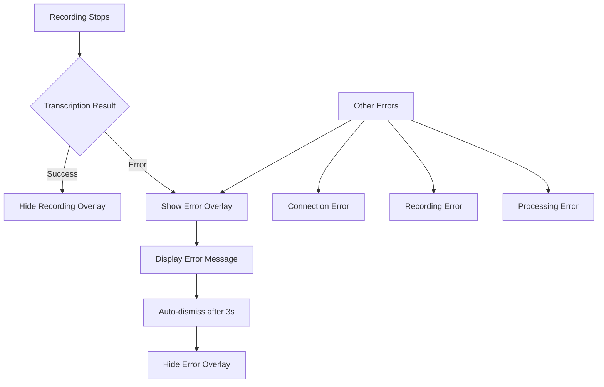

# Error Overlay Implementation Plan

## Overview
Create a visual error feedback overlay for the LocalFlow Desktop Agent that displays when speech-to-text transcription fails, eliminating the need to check the terminal for error messages.

## Architecture



## Implementation Steps

### 1. Create ErrorOverlay Class
**File:** `agent/error_overlay.py`

Create a new overlay class similar to `RecordingOverlay` but for displaying error messages:

- **Visual Design:**
  - Red/dark background theme to indicate error state
  - Error icon (X or warning symbol)
  - Error message text (truncated if too long)
  - Subtle pulsing animation to draw attention
  - Semi-transparent, always-on-top window
  - Positioned in same bottom-right corner as recording overlay

- **Key Methods:**
  - `show(message: str, duration_ms: int = 3000)` - Show overlay with error message
  - `hide()` - Hide overlay immediately
  - Auto-dismiss after specified duration

### 2. Integrate ErrorOverlay into LocalFlowAgent
**File:** `agent/localflow-agent.py`

Import and instantiate the ErrorOverlay class alongside RecordingOverlay.

**Integration Points:**

#### A. Dictation Result Handler (Line 311-329)
When `dictation_result` event has `success: false`, call `error_overlay.show(error_message)`:
```python
@self.sio.on("dictation_result", namespace="/agent")
def on_dictation_result(data):
    if data.get("success"):
        # existing success handling
    else:
        error = data.get("error", "Unknown error")
        log_error(f"Dictation failed: {error}")
        self.error_overlay.show(f"Transcription failed: {error}")
```

#### B. Audio Recorder Error Handling (Line 154-157)
When recording fails to start, show error overlay:
```python
def start(self) -> bool:
    except Exception as e:
        log_error(f"Failed to start recording: {e}")
        self.agent.error_overlay.show(f"Recording failed: {e}")
        return False
```

#### C. Connection Error Handling (Line 304-305, 357-361)
Show overlay for connection failures (with different message for initial vs retry):
```python
@self.sio.on("connect_error", namespace="/agent")
def on_connect_error(error):
    log_error(f"Connection error: {error}")
    # Only show if this is a user-initiated action or periodic retry
```

#### D. Not Connected Error (Line 418-419)
When audio sent but not connected:
```python
if not self.connected:
    log_error("Not connected to server")
    self.error_overlay.show("Not connected to server. Check your connection.")
```

### 3. Error Message Categories

Define clear error categories for user-friendly messages:

| Error Type | User Message |
|------------|--------------|
| Transcription failed | "Couldn't transcribe audio. Please try again." |
| No speech detected | "No speech detected. Please speak clearly." |
| Connection lost | "Connection lost. Reconnecting..." |
| Server not responding | "Server not responding. Check your connection." |
| Recording failed | "Couldn't access microphone. Check permissions." |
| Rate limit exceeded | "Too many requests. Please wait a moment." |

### 4. Technical Specifications

**ErrorOverlay Design:**
- Width: 250px, Height: 60px
- Background: #2d1f1f (dark red tint)
- Border: 1px solid #ff6b6b (red)
- Text color: #ffcccc (light red)
- Icon: Red X or warning triangle
- Position: Bottom-right corner (same as recording overlay)
- Animation: Subtle pulse/glow effect
- Duration: 3 seconds default, dismissible by clicking

**Threading:**
- Same pattern as RecordingOverlay (daemon thread)
- Thread-safe with locks
- Non-blocking to main agent flow

## Error Scenarios to Handle

1. **Transcription API errors** - Groq API down, rate limits, invalid API key
2. **Network errors** - Connection lost, timeout, server unreachable
3. **Audio errors** - Microphone access denied, no audio captured
4. **Processing errors** - Refinement failed, model errors
5. **Configuration errors** - Missing API keys, invalid settings

## Testing Checklist

- [ ] Error overlay displays on transcription failure
- [ ] Error overlay displays on connection error
- [ ] Error overlay displays on recording failure
- [ ] Overlay auto-dismisses after timeout
- [ ] Overlay can be dismissed by clicking
- [ ] Multiple rapid errors don't create overlapping overlays
- [ ] Error messages are user-friendly (not technical stack traces)
- [ ] Overlay works on Windows, macOS, and Linux

## Files to Modify

1. **Create:** `agent/error_overlay.py` - New error overlay class
2. **Modify:** `agent/localflow-agent.py` - Integrate error overlay and add error triggers

## Future Enhancements (Optional)

- Different overlay styles for warnings vs errors
- Persistent notification area for multiple errors
- Sound effect for errors (if sound effects enabled)
- Click to retry functionality
